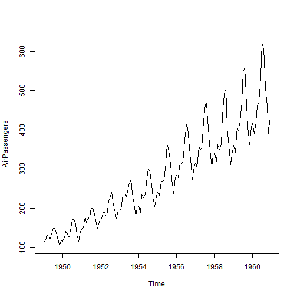
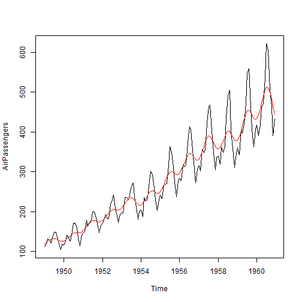

Week4_Assignment
========================================================
author: "Sven"
date: "6 Oktober 2018"
autosize: true

Assignment content
========================================================

- Build a shiny web application
- Publish it on a R server
- Build a Pitch presentation


App content
========================================================


The Shiny web application build is  used to add a smoothing line to the output of the Airpassengers dataset, which is built in in R. You can access it with "AirPassengers". It contains the monthly Airline Passenger Numbers from 1949-1960. 



Feature in App
========================================================

By adjusting the slider in the app for the smoothing parameter the smoothing line in the plot, colored in red, will change accordingly. The lower the value the more reactive the smoothing is.



Source Code
========================================================


```r
 plot(AirPassengers)
 lines(smooth.spline(AirPassengers, spar = .5), col = "red")
```


